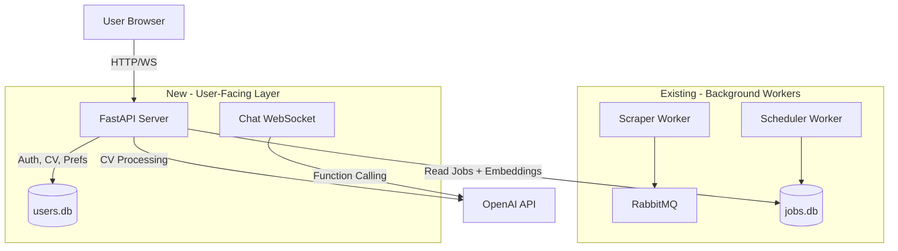
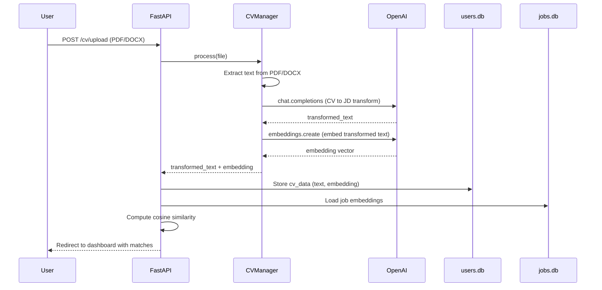

# User-Facing Web Layer for JobTaker

## Architecture Overview

The existing system runs background workers (scheduler + scraper) that collect and embed jobs. The new layer adds a **FastAPI web server** that users interact with, running as a **separate Docker service** alongside the existing worker.




## Key Design Decisions

- `**app/api/**` is the new package for the web server (separate from `app/workers/`)
- `**users.db**` is a new SQLite database for user accounts, CV data, embeddings, and preferences
- **Two Docker services**: `worker` (existing scheduler) and `web` (new FastAPI) sharing the same image but different CMDs
- **JWT auth** with `python-jose` + `passlib` for simple stateless authentication
- **WebSocket** endpoint for the chat interface
- **OpenAI function calling** for the chat to modify filters (e.g., "show me only remote jobs in Tel Aviv")

## New Files to Create

### 1. FastAPI App -- `app/api/main.py`

- FastAPI application factory
- Mount routes, CORS middleware, static files
- Startup: initialize DB connections
- Run with: `uvicorn app.api.main:app --host 0.0.0.0 --port 8000`

### 2. API Routes

- `**app/api/routes/auth.py**` -- `POST /register`, `POST /login`, token refresh
- `**app/api/routes/cv.py**` -- `POST /cv/upload` (multipart file upload, triggers pipeline)
- `**app/api/routes/jobs.py**` -- `GET /jobs/matches` (cosine similarity ranked), `GET /jobs/filters`
- `**app/api/routes/chat.py**` -- WebSocket `/ws/chat` for the AI assistant

### 3. User Database -- `app/db/schema/users_schema.py`

```sql
-- users table
CREATE TABLE users (
    id INTEGER PRIMARY KEY AUTOINCREMENT,
    email TEXT UNIQUE NOT NULL,
    password_hash TEXT NOT NULL,
    full_name TEXT,
    created_at TIMESTAMP DEFAULT CURRENT_TIMESTAMP
);

-- cv_data table (stores processed CV per user)
CREATE TABLE cv_data (
    id INTEGER PRIMARY KEY AUTOINCREMENT,
    user_id INTEGER NOT NULL REFERENCES users(id),
    original_filename TEXT,
    raw_text TEXT,
    transformed_text TEXT,
    embedding BLOB,
    uploaded_at TIMESTAMP DEFAULT CURRENT_TIMESTAMP
);

-- user_filters table (persists chat-modified filters)
CREATE TABLE user_filters (
    user_id INTEGER PRIMARY KEY REFERENCES users(id),
    location TEXT,
    department TEXT,
    workplace_type TEXT,
    experience_level TEXT,
    min_similarity REAL DEFAULT 0.5
);
```

### 4. Services

- `**app/services/cv_manager.py**` -- Refactor from `[app/wheretoplace/embed_cv.py](app/wheretoplace/embed_cv.py)`. The 3 OpenAI calls are:
  1. `chat.completions.create()` -- transform CV to JD format
  2. `embeddings.create()` -- embed the transformed text
  3. (Future/optional) A second chat call for extracting structured metadata (skills, experience level)
- `**app/services/matching_service.py**` -- Load job embeddings from `jobs.db`, compute cosine similarity against user's CV embedding, return ranked results with filters applied
- `**app/services/chat_service.py**` -- OpenAI chat with function calling; functions include `set_filter`, `clear_filters`, `get_current_filters`; returns both a chat message and filter-change actions

### 5. Auth Utilities -- `app/api/auth.py`

- JWT token creation/validation (`python-jose`)
- Password hashing (`passlib[bcrypt]`)
- FastAPI dependency `get_current_user`

### 6. Frontend -- `app/api/static/` and `app/api/templates/`

- Minimal Jinja2 templates + vanilla JS (or HTMX)
- Pages: Login, Dashboard (job matches list + chat sidebar)
- Chat panel uses WebSocket, always visible on the right side
- Job cards showing title, company, location, similarity score

## Existing Files to Modify

- `**[pyproject.toml](pyproject.toml)**` -- Add deps: `fastapi`, `uvicorn[standard]`, `python-jose[cryptography]`, `passlib[bcrypt]`, `python-multipart`, `jinja2`
- `**[docker-compose.prod.yml](docker-compose.prod.yml)**` -- Split into two services:
  - `worker` -- runs `python -m app.workers.scheduler` (existing)
  - `web` -- runs `uvicorn app.api.main:app --host 0.0.0.0 --port 8000`
  - Both share a volume for the `data/` folder (SQLite DBs)
- `**[app/Dockerfile](app/Dockerfile)**` -- Add `COPY app/api/static/` and `COPY app/api/templates/` if using templates; no CMD change (overridden in compose)
- `**[app/services/cv_manager.py](app/services/cv_manager.py)**` -- Implement the full CV pipeline (move logic from `embed_cv.py`)
- `**[app/core/db_utils.py](app/core/db_utils.py)**` -- Add `UsersDB` class for users.db operations

## CV Upload Flow (per user)




## Chat Flow

The chat uses OpenAI function calling so the LLM can programmatically adjust filters:

- **Functions exposed to OpenAI**: `set_location_filter(location)`, `set_department_filter(dept)`, `set_workplace_filter(type)`, `clear_all_filters()`, `set_min_similarity(threshold)`
- User says: "Show me only remote Python jobs" -> OpenAI calls `set_workplace_filter("Remote")` and `set_department_filter("Engineering")` -> filters persisted to `user_filters` -> job list refreshes
- Chat history maintained per session (in-memory or stored in DB)

## Docker Compose Changes

```yaml
services:
  worker:
    image: ghcr.io/${GHCR_USER}/jobtaker:latest
    command: ["python", "-m", "app.workers.scheduler"]
    volumes:
      - app_data:/app/data
    depends_on:
      rabbitmq:
        condition: service_healthy

  web:
    image: ghcr.io/${GHCR_USER}/jobtaker:latest
    command: ["uvicorn", "app.api.main:app", "--host", "0.0.0.0", "--port", "8000"]
    ports:
      - "8000:8000"
    volumes:
      - app_data:/app/data

  rabbitmq:
    # ... unchanged ...

volumes:
  app_data:
  rabbitmq_data:
```

## Concurrency Notes (10 users)

- FastAPI/uvicorn handles async I/O natively -- 10 users is trivial
- SQLite supports concurrent **reads** but only one **write** at a time. For 10 users this is fine (writes are infrequent: CV upload, filter changes). Use `aiosqlite` with WAL mode for better concurrency
- OpenAI API calls are the real bottleneck (~2-5s each). Use `async` OpenAI client so one user's CV processing doesn't block others
- WebSocket connections are lightweight; 10 concurrent is nothing for uvicorn

## Security Notes

- Move API keys out of `[config.yaml](config.yaml)` into environment variables before going live (the OpenAI key is currently in plaintext)
- JWT secret should be an environment variable
- Since you're exposing via Tailscale, the network is already encrypted, but auth is still important for multi-user isolation

